# API 키 발급 안내 (그림)

patent-api를 쓰려면 키 두 종류가 필요합니다. 둘 다 **무료**이고, 각자 자기 이름으로 발급받습니다.

| 키 | 어디서 | 비용·한도 | 걸리는 시간 |
|---|---|---|---|
| **KIPRIS Plus 인증키** (한국 특허) | [plus.kipris.or.kr](https://plus.kipris.or.kr) | 무료, 월 1,000회 (매월 1일 초기화) | 약 10분, 바로 사용 |
| **EPO OPS Consumer Key / Secret** (해외·패밀리·법적 상태·청구항) | [developers.epo.org](https://developers.epo.org) | 무료, 주 4GB | 가입 10분 + **EPO 승인 1~2 영업일** |

> 그림 속 이름·키 값은 가렸습니다. 사이트 화면은 2026년 10월 기준이라 바뀌었을 수 있습니다.

---

## 1. KIPRIS Plus 인증키

### 1-1. 회원가입

[회원가입 화면](https://plus.kipris.or.kr/portal/member/joinView.do?menuNo=200028)에서 약관에 동의하고
**일반(개인) 회원**으로 가입합니다. 휴대폰 **본인인증**과 **이메일 인증**이 필요합니다.

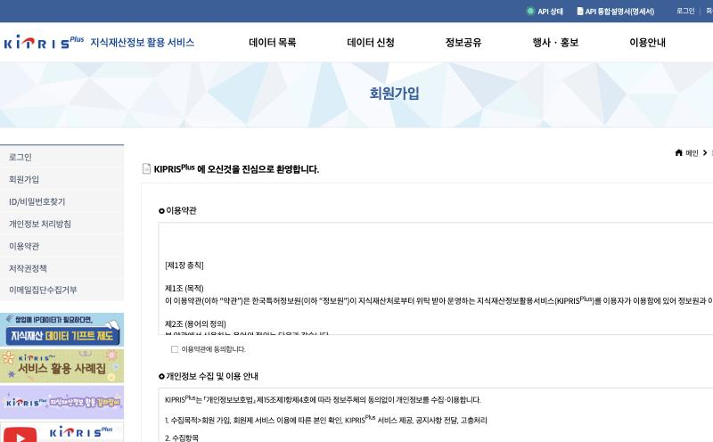

> 💡 본인인증 창이 안 뜨면 크롬·사파리 같은 일반 브라우저에서 가입하세요. 앱 안의 미니 브라우저에서는 인증 창이 막힐 수 있습니다.

가입하면 키는 바로 나오지만(1-6), **아직은 쓸 수 없습니다.** 아래 1-2~1-5의 "Open API 신청"을 해야 이용기간이 생깁니다.
신청하지 않고 쓰면 `resultCode 31 (DEADLINE_HAS_EXPIRED_ERROR)` 오류가 납니다.

### 1-2. 데이터 신청 → Open API

로그인한 뒤 위 메뉴 **데이터 신청 → Open API**로 갑니다.

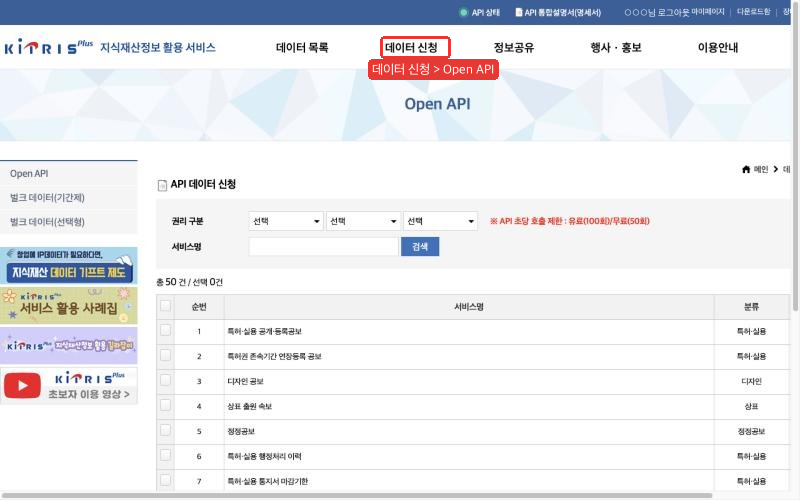

### 1-3. 필요한 상품 체크

목록에서 쓸 상품에 체크합니다. **"서비스명" 검색칸**에 이름을 넣으면 빨리 찾을 수 있습니다.

| 구분 | 상품 | 켜지는 도구 · 쓰임 |
|---|---|---|
| **필수** | 특허·실용 공개·등록공보 | `kr_biblio`, `kr_search` — 서지·검색 (항상 켜짐) |
| 추천(OA) | 의견제출통지서 · 거절결정서 · 등록결정서 | `kr_exam_documents` — 거절이유·심사 대상 청구항·관련 법조항·인용발명, 등록결정 내용 |
| 추천(OA) | 청구항 변동 이력 | `kr_claim_history` — 보정서마다 신규·수정·삭제된 청구항과 바뀐 부분 |
| 추천 | 특허·실용 통지서 마감기한 | `kr_deadlines` — 통지서 마감일(⚠️ 참고용, 공식 기한관리 대체 불가) |
| 추천 | 등록사항 | `kr_registration` — 현재 권리자·권리 이전·존속기간 만료일·연차료 납부 기록 |
| 추천 | 특허·실용 인용문헌 · 특허·실용 피인용문헌 | `kr_citations` — 인용한 문헌 / 이 출원을 인용한 출원 |
| 선택 | 법적 상태 이력(특허·실용(ST.27), 상표, 디자인(ST.87)) | `kr_legal_history` — 출원~소멸 법적 상태 이벤트(ST.27) |
| 선택 | 특허 패밀리 | `kr_family` — 한국 출원번호로 해외 패밀리 |

신청한 상품은 확장 설정(아래 3번)의 **KIPRIS 상품** 체크칸에서 켭니다. 켠 상품의 도구만 Claude에 나타납니다.
신청하지 않은 상품을 켜 두면 처음 조회할 때 "KIPRIS에서 '<상품명>'을 무료 신청하면 바로 쓸 수 있다"는 안내가 나오고,
이 상태를 하루 기억했다가 다음 조회 때 다시 확인합니다(신청하면 자동으로 풀림). 상품별 상태는 `quota_status`에서 봅니다.

> ⚠️ 전체선택으로 50개를 모두 담지 마세요. 무료 1,000회는 **신청한 상품 전체의 합계**입니다.

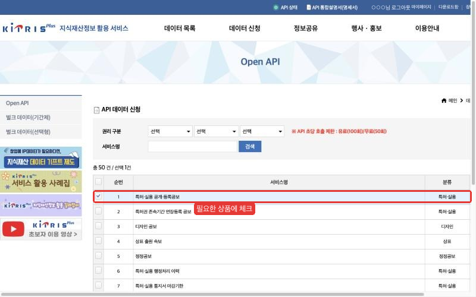

### 1-4. 장바구니에 담기

맨 아래 **장바구니** 버튼 → 확인창에서 **확인** → "장바구니로 이동하시겠습니까?"도 **확인**.

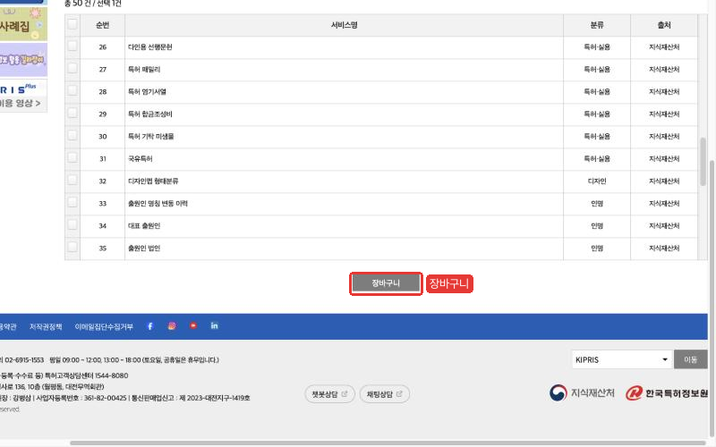

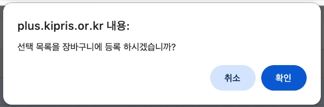

### 1-5. 장바구니에서 무료로 신청 ⚠️ 가장 중요

**기본값이 "유료(무제한)"입니다.** 그대로 신청하면 유료 견적이 나옵니다.

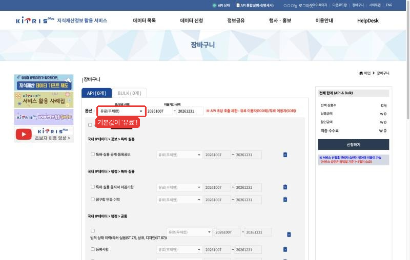

1. 맨 위 **옵션**을 **무료(월 1,000건 호출 제한)** 으로 바꿉니다. 아래 상품들이 한꺼번에 바뀝니다.

   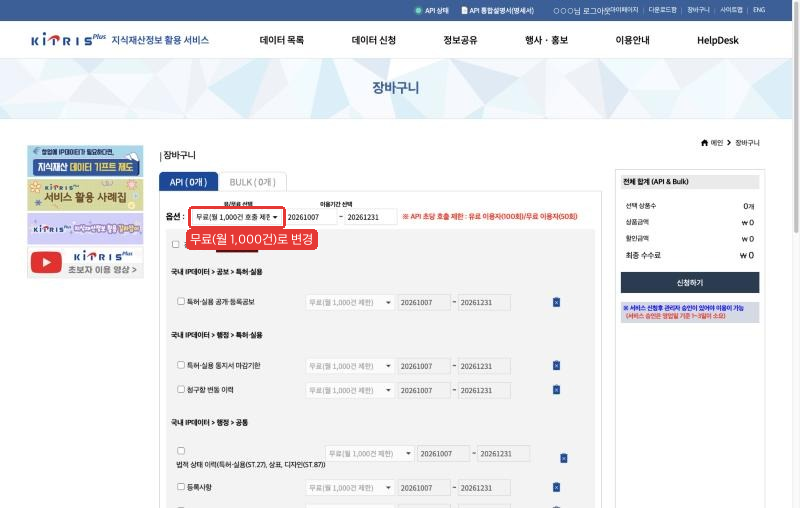

2. 모든 상품이 **무료**인지 눈으로 확인합니다.

   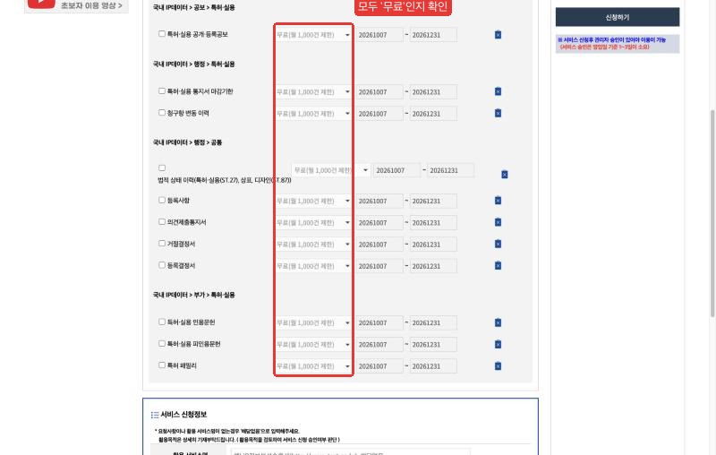

3. **이용기간**은 그해 **12월 31일까지만** 고를 수 있습니다. 그대로 두면 됩니다.
   → **해가 바뀌면 다시 신청**해야 합니다(1월에 1-2부터 반복).

   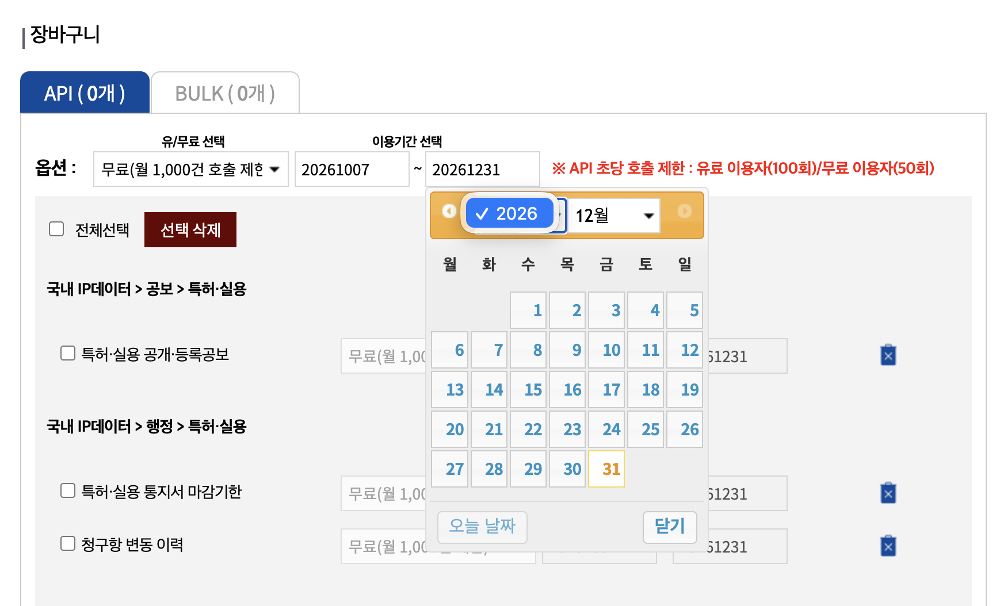

4. **전체선택**에 체크하고, 오른쪽 **최종 수수료가 ₩0**인지 확인합니다.
5. 아래 **서비스 신청정보**를 채웁니다.

   | 칸 | 예시 |
   |---|---|
   | 활용 서비스명 | `해당없음` |
   | 활용 목적 | `내부시스템 개발` (다음 칸이 나오면 `IP조사/분석`) |
   | 요청사항 | `무료(월 1,000건)로 이용합니다. 특허 사무 내부용 조회 도구.` |
   | 동의 | 이용약관 동의에 체크 |

   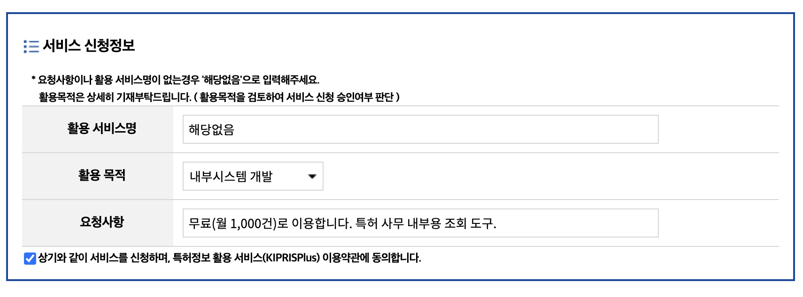

6. 오른쪽 **신청하기** → "선택 상품을 신청하시겠습니까?" **확인**.

   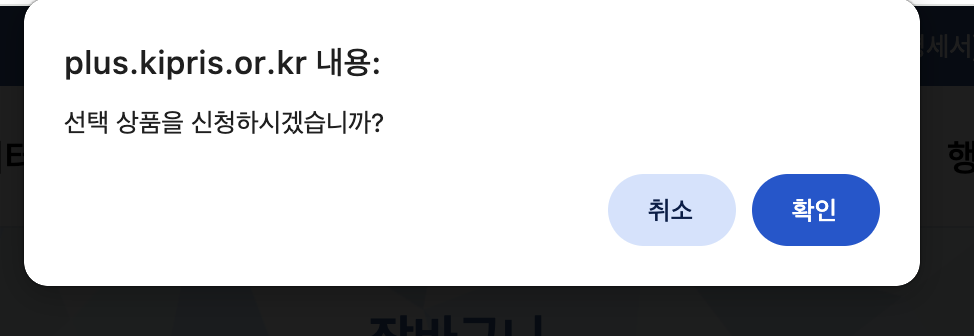

> 장바구니에 "관리자 승인 1~3일"이라고 적혀 있지만, 무료 플랜은 2026년 10월 확인 당시 **신청 직후 바로** 쓸 수 있었습니다.
> 신청 내역은 마이페이지 → 서비스 구매내역에서 볼 수 있습니다.

### 1-6. 인증키 복사

**마이페이지 → API KEY 관리**의 **REST AccessKey** 값이 KIPRIS 인증키입니다(44자리).
칸을 클릭 → ⌘A(전체 선택) → ⌘C(복사).

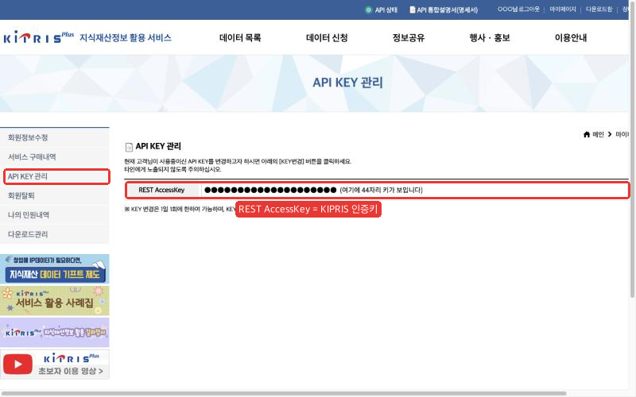

> ⚠️ 옆의 **Key 변경** 버튼은 누르지 마세요. 키가 바뀌고 하루 한 번만 바꿀 수 있습니다.
> 키는 비밀번호처럼 다루세요. 메신저·메일로 남에게 보내지 마세요.

---

## 2. EPO OPS Consumer Key / Secret

### 2-1. 가입 (Register)

[developers.epo.org](https://developers.epo.org) 오른쪽 위 **Register**.

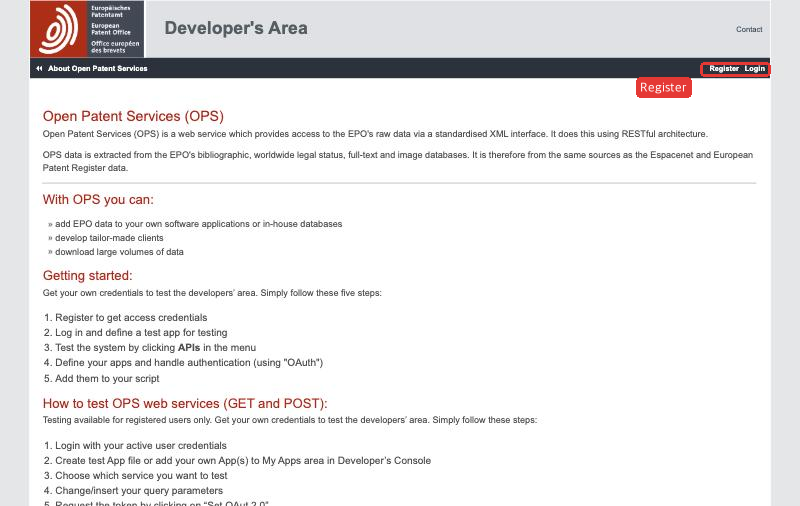

양식(영문)은 이렇게 채웁니다.

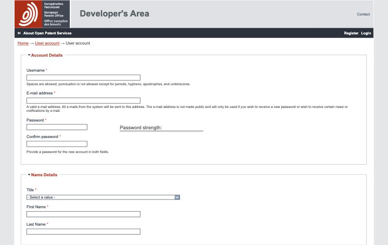

| 칸 | 넣을 값 |
|---|---|
| Username / E-mail / Password | 아이디(영문) / 이메일 / 비밀번호 |
| Title, First Name, Last Name | Mr./Ms., 이름, 성 (영문) |
| Organisation/Company name | 소속 영문명 |
| Street / City / Postal code | 영문 주소 / 도시 / 우편번호 |
| Country/territory | **South Korea** |
| Telephone number (office) | 예: +82-2-1234-5678 |
| Organisation type | **Patent attorney** (해당하는 것) |
| **Account Type** | **Non-paying** ← 꼭 이것 (무료) |
| What do you need OPS for? | **Building/enriching in-house database(s) for internal use** |
| In what business branch are you? | **Patent attorney / legal profession** (해당하는 것) |
| 체크박스 2개 | 약관 동의, 소속을 대표해 가입 권한 있음 |
| CAPTCHA | 그림 속 글자 |

### 2-2. 이메일 확인 → EPO 승인 기다리기

제출하면 "이메일 링크로 확인하라"는 초록 상자가 나옵니다. 메일의 링크를 누르면
**"Your e-mail address has been confirmed. Your account is pending EPO administrator approval."** 로 바뀝니다.
이제 EPO 담당자가 **승인**할 때까지(보통 1~2 영업일) 기다립니다. 승인 메일이 오면 로그인할 수 있습니다.

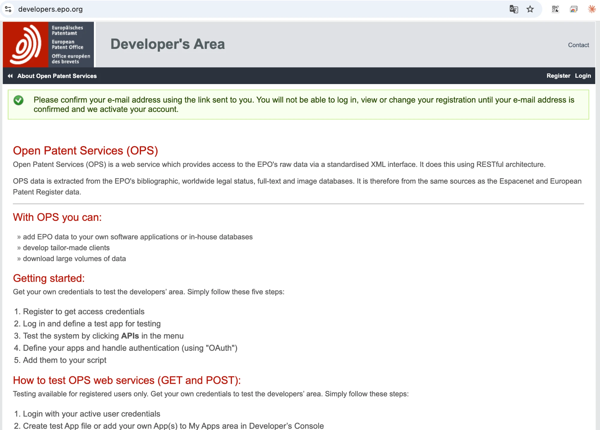

### 2-3. 로그인

승인 메일이 오면 [로그인 화면](https://developers.epo.org/user/login)에서 Username·Password를 넣고 **Log In**.

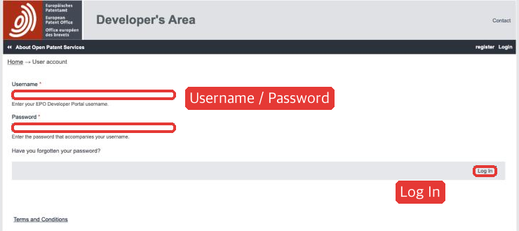

### 2-4. 앱 만들기

1. 위 메뉴 오른쪽의 **My Apps**를 누릅니다.

   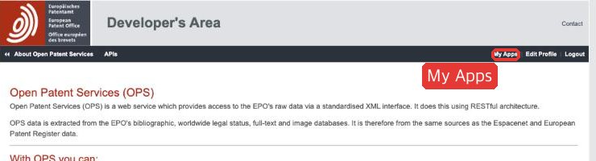

2. **Add a new App**을 누릅니다.

   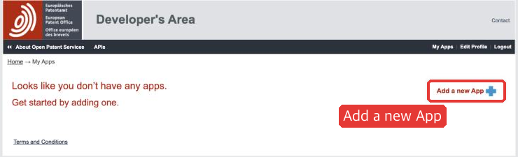

3. **App Name**에 아무 이름(예: `patent-api`)을 넣고 **Create App**. 입력칸은 이것 하나뿐입니다.

   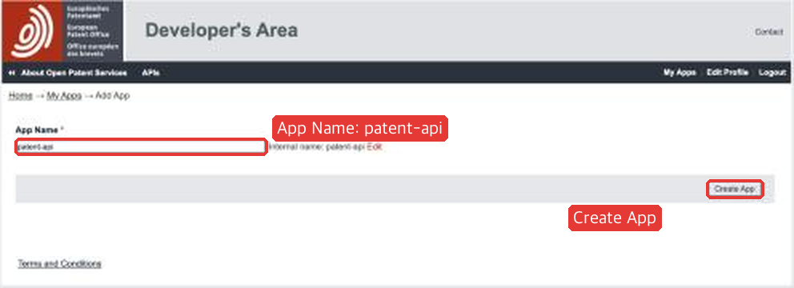

4. "App Created!"가 나오면 목록에서 **만든 앱 이름**을 누릅니다.

   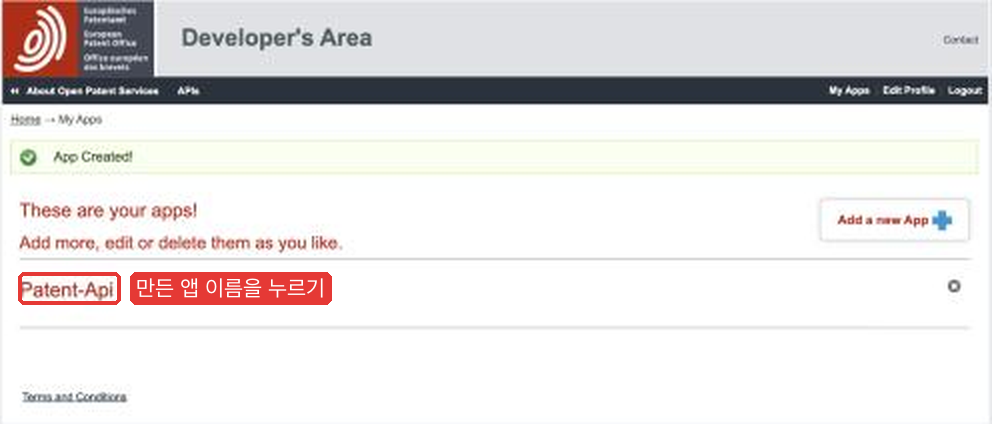

### 2-5. 키 복사

**Keys** 탭의 **Consumer Key**와 **Consumer Secret Key**를 각각 복사합니다.

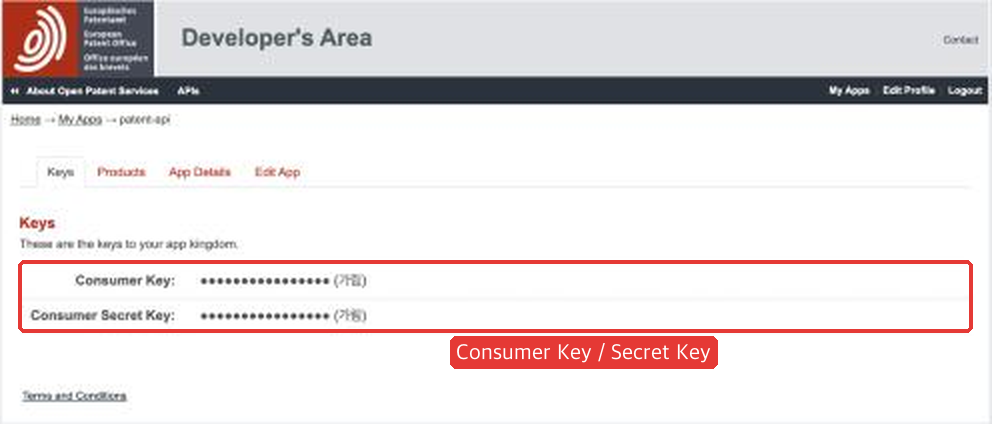

**Products** 탭에서 **OPS — Approval Status: Approved**인지 확인합니다. 2026년 10월 확인 당시에는 앱을 만들면 바로 승인됐습니다.

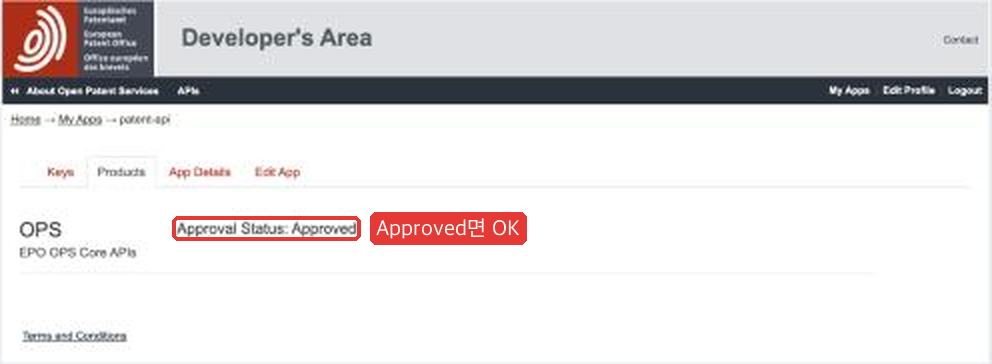

> 키는 비밀번호처럼 다루세요. 새어 나갔으면 이 앱을 지우고(Edit App) 새로 만들면 키가 바뀝니다.

---

## 3. 설치하고 키 넣기

### 확장 파일(.mcpb)로 설치 — Claude 데스크톱 앱·코워크용 (추천)

1. 받은 **`patent-api.mcpb`를 더블클릭**합니다.
   (안 열리면 Claude 데스크톱 앱 → **설정 → 확장 프로그램** 화면에 파일을 끌어다 놓습니다.)
2. 확장 화면에서 **설치**(이미 설치돼 있으면 **업데이트**)를 누릅니다.

   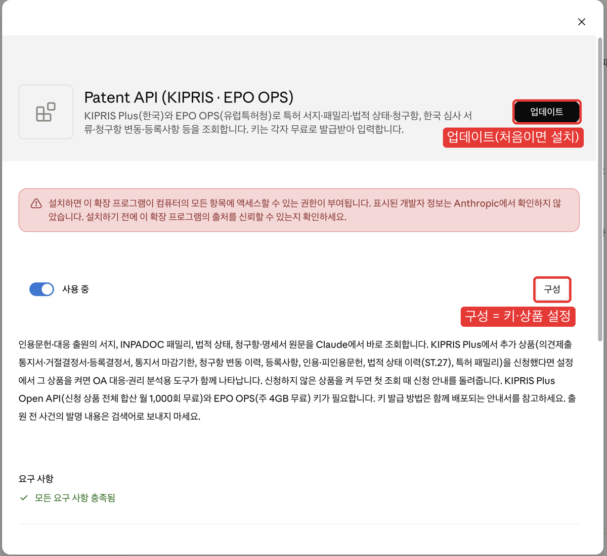

   > 빨간 경고("컴퓨터의 모든 항목에 액세스할 수 있는 권한… 개발자 정보는 Anthropic에서 확인하지 않았습니다")는
   > Anthropic 공식 목록에 없는 확장이면 누구에게나 나오는 문구입니다. 이 확장의 코드가 접속하는 곳은 KIPRIS·EPO 서버뿐이고,
   > 소스는 [GitHub](https://github.com/describug/patent-api-mcp)에서 누구나 확인할 수 있습니다.
   > 믿을 수 있는 사람에게서 받은 파일인지 확인하고 설치하세요.

   확인창이 뜨면 **설치**를 누릅니다. 실행에 필요한 부품을 내려받느라 처음에는 몇 분 걸릴 수 있습니다.

   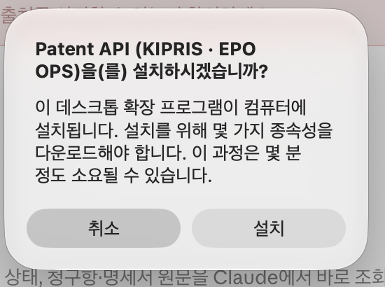

3. 같은 화면의 **구성** 버튼(또는 **설정 → 확장 프로그램 → Patent API (KIPRIS · EPO OPS) → 구성**)을 누릅니다.
   - 위쪽 칸 3개에 **KIPRIS Plus 인증키 / EPO OPS Consumer Key / EPO OPS Consumer Secret**을 붙여 넣습니다.
     넣은 값은 ●로 가려져 보입니다. 아직 없는 키는 비워 두고 나중에 넣어도 됩니다. 월 호출 한도는 1000 그대로.

     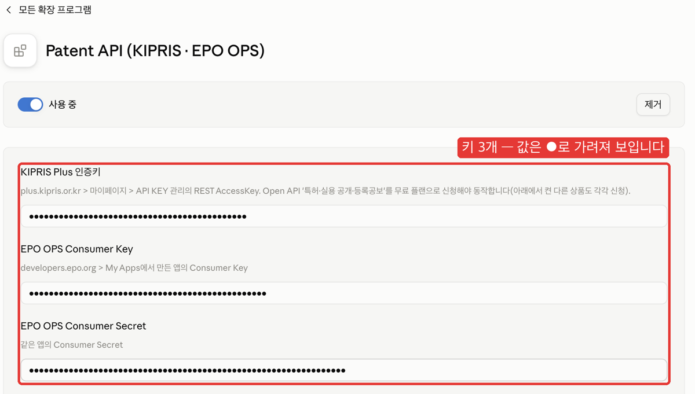

   - 아래쪽 **KIPRIS 상품: …** 체크칸에서 1-3에서 신청한 상품만 켭니다.
     '특허·실용 공개·등록공보'는 항상 켜져 있어서 체크칸이 없습니다.

     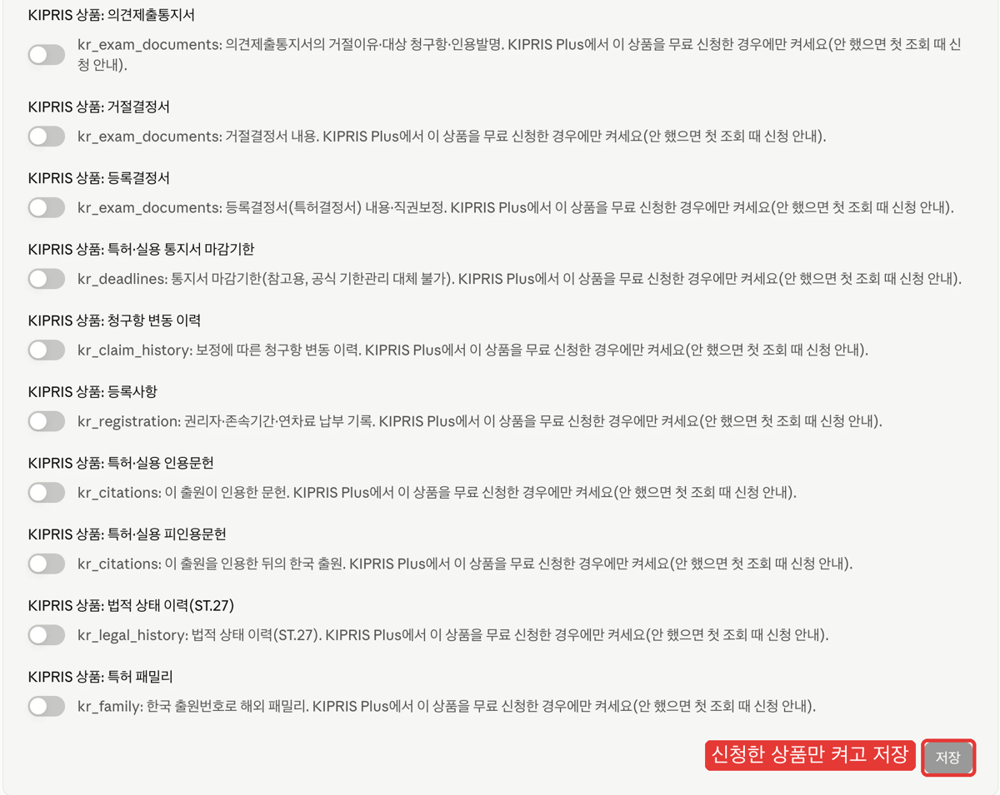

4. **저장**합니다.
5. **Claude 데스크톱 앱을 완전히 종료(⌘Q)했다가 다시 엽니다.** 그래야 새 설정으로 다시 시작합니다.
6. 새 대화(또는 코워크 작업)에서 "patent-api의 quota_status 보여줘"라고 해서 `kipris: true`, `epoOps: true`인지 확인합니다.

   쓸 수 있는 도구는 확장 화면 아래쪽 **도구 권한**에서 볼 수 있습니다. 기본 7개이고, 켠 KIPRIS 상품에 따라 최대 14개까지 늘어납니다.
   도구마다 「항상 허용 / 승인 필요 / 차단」을 고를 수 있습니다. 모두 조회만 하는 도구라 「항상 허용」으로 두면 매번 묻지 않습니다.

   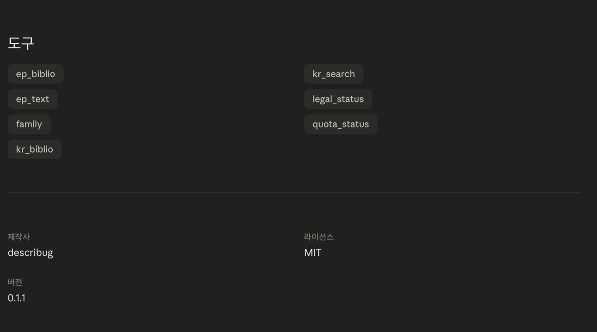

> 키는 맥 키체인(윈도우는 자격 증명 관리자)에 저장되고, 파일로는 남지 않습니다.
> 키를 바꿀 때도 3~5번(설정 → 저장 → 앱 재시작)을 반복합니다.

### 소스로 설치 — Claude Code(CLI)·다른 MCP 도구용

프로젝트 폴더의 `.env`에 넣습니다. `.env`는 숨김 파일이라 Finder에서 안 보이면 **⌘+Shift+.(마침표)** 를 누르거나,
터미널에서 `open -e .env`로 엽니다.

  ```
  KIPRIS_SERVICE_KEY=여기에 KIPRIS 인증키
  EPO_OPS_CONSUMER_KEY=여기에 Consumer Key
  EPO_OPS_CONSUMER_SECRET=여기에 Consumer Secret
  # 1-3에서 신청한 KIPRIS 상품(쉼표로). 쓸 수 있는 이름은 README의 상품 표 참고. 전부면 all
  PATENT_API_KIPRIS_PRODUCTS=publication,opinion,rejection,allowance,claim_history
  ```

넣은 뒤 Claude를 다시 시작하고, Claude에게 "quota_status 보여줘"라고 하면 키 설정 여부(값은 안 보임)를 확인할 수 있습니다.

## 자주 묻는 질문

- **코워크에서 도구가 안 보여요.** 코워크는 데스크톱 앱에 **확장으로 설치된** 도구를 씁니다. 3번의 확장 파일 설치를 하고 앱을 재시작하세요.
  `claude_desktop_config.json`에 직접 적는 방식은 앱이 설정을 다시 쓰면서 지워질 수 있습니다.
- **ChatGPT에서도 쓸 수 있나요?** 지금은 안 됩니다. ChatGPT는 인터넷 주소(원격 서버)로만 연결합니다.
  Claude 데스크톱·Claude Code, OpenAI Codex CLI, Cursor, VS Code 같은 로컬 MCP 지원 도구에서는 쓸 수 있습니다.
- **월 1,000회면 충분한가요?** 같은 번호를 다시 조회하면 저장해 둔 결과(캐시)를 쓰므로 호출 수가 늘지 않습니다.
  남은 양은 `quota_status`로 봅니다.

## 자주 나오는 오류

| 메시지 | 원인 | 할 일 |
|---|---|---|
| `CONFIG_MISSING_KEY` | 키를 안 넣음 | 3번대로 키 넣고 Claude 재시작 |
| KIPRIS `resultCode 31` (이용기간 없음) | Open API 신청 안 함 / 해가 바뀜 | 1-2~1-5 신청 (무료) |
| KIPRIS `resultCode 30` | 키가 틀림 | 1-6에서 다시 복사 |
| `PRODUCT_NOT_SUBSCRIBED` (`resultCode 101`·`31`) | 켠 KIPRIS 상품을 신청하지 않음 | 안내된 상품을 1-3~1-5대로 무료 신청 → `quota_status`를 `recheck_products=true`로 부르면 바로 다시 확인 |
| EPO `AUTH_FAILED` | Key/Secret이 틀리거나 계정 승인 전 | 2-5에서 다시 복사, 승인 메일 확인 |
| `QUOTA_EXCEEDED` | 월 1,000회(KIPRIS) 또는 주 4GB(EPO) 초과 | 다음 달(주)까지 기다림. 캐시된 자료는 계속 조회됨 |
